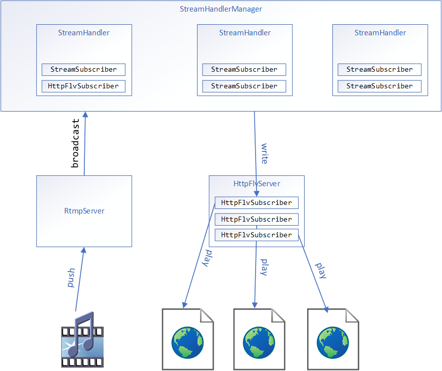

# J4Live
[English](README_en.md)

### 介绍
J4Live (java for live) 是一个利用netty网络框架实现的RTMP直播服务器，目前实现了obs推流，利用flvjs播放的效果

#### 支持的传输协议
- [x] RTMP (push)
- [x] HTTP-FLV
- [x] AMF0
- [ ] AMF3
- [ ] HLS

### 架构

### 使用
mvn package

java -jar xxx.jar
 
通过`RTMP`协议推送视频流到地址 `rtmp://127.0.0.1:1935/{app}/{name}` (app默认是`live`) 例如OBS软件

播放: 目前支持FLV播放 地址http://127.0.0.1:8080/{app}/{name} ，可以参照 http-flv-demo.html 例子

### 相关协议规范
[RTMP协议规范](https://wwwimages2.adobe.com/content/dam/acom/en/devnet/rtmp/pdf/rtmp_specification_1.0.pdf)

[AMF0维基](https://en.wikipedia.org/wiki/Action_Message_Format#AMF0)

[AMF0规范](https://www.adobe.com/content/dam/acom/en/devnet/pdf/amf0-file-format-specification.pdf)

[FLV视频格式说明](http://download.macromedia.com/f4v/video_file_format_spec_v10_1.pdf)

### TODO
本项目是用来熟悉netty使用和学习传输协议设计的项目

如果你对本项目有什么不懂的，你可以给我留言，我们可以相互学习。😁

### 参考项目
[livego](https://github.com/gwuhaolin/livego)

[MyLive](https://github.com/YuboLong/MyLive)

[flazr](https://github.com/mconf/flazr)